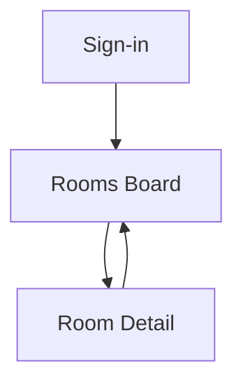

## 1. Product Overview
A mobile-first PWA for hotel/hostel housekeeping teams to track room cleaning and release readiness.
It provides Supabase-based sign-in + role-based controls, and a simple room-status workflow from dirty to released.

## 2. Core Features

### 2.1 User Roles
| Role | Registration Method | Core Permissions |
|------|---------------------|------------------|
| Housekeeper | Admin-created Supabase user (email/password or magic link) | View assigned/all rooms, change status within allowed workflow steps, add notes/photos (optional field) |
| Supervisor / Inspector | Admin-created Supabase user | View all rooms, move rooms to **Inspected**, reject back to **In Progress**, add inspection notes |
| Front Desk / Release Approver | Admin-created Supabase user | View all rooms, move rooms to **Released**, revert if needed, view audit trail |
| Admin | Supabase project admin / designated role | Manage user roles, configure allowed statuses/transitions, view reporting |

### 2.2 Feature Module
Our housekeeping room-release requirements consist of the following main pages:
1. **Sign-in**: email login, session restore, role-aware redirect.
2. **Rooms Board**: status summary, room cards list, filters/sort, quick status update, create/update notes, offline-friendly UI states.
3. **Room Detail**: room header + current status, full timeline/audit trail, controlled status transition action(s), issue/notes log.

### 2.3 Page Details
| Page Name | Module Name | Feature description |
|-----------|-------------|---------------------|
| Sign-in | Authentication | Sign in via Supabase Auth; persist session; show errors; route by role. |
| Rooms Board | Status overview | Show counts by status (e.g., Dirty/In Progress/Cleaned/Inspected/Released). |
| Rooms Board | Room cards list | List rooms as tappable cards; show room number, status chip, last update time, assignee (if used). |
| Rooms Board | Filters & sorting | Filter by status/floor/assignee; search by room number; sort by last updated. |
| Rooms Board | Quick actions | Allow permitted one-tap transition (e.g., Housekeeper: Dirty→In Progress, In Progress→Cleaned). |
| Rooms Board | Sync & feedback | Show loading/sync indicators; handle permission denials; show last synced timestamp. |
| Room Detail | Room summary | Display room metadata and current status; show allowed next actions based on role + current status. |
| Room Detail | Status transition | Perform a status change with optional note; validate transition rules; confirm destructive actions (revert). |
| Room Detail | Audit trail | Show chronological list of status changes with user and timestamp; support basic pagination. |
| Room Detail | Notes | Add and view notes tied to the room (e.g., minibar missing, extra towels). |

## 3. Core Process
**Housekeeper Flow**: Sign in → open Rooms Board → filter to Dirty/In Progress → tap room card → start cleaning (set **In Progress**) → complete cleaning (set **Cleaned**) with optional note → repeat.

**Supervisor/Inspector Flow**: Sign in → Rooms Board → filter to Cleaned → open room → inspect → set **Inspected** or revert to **In Progress** with note.

**Front Desk / Release Flow**: Sign in → Rooms Board → filter to Inspected → open room → set **Released** so the room is sellable.

