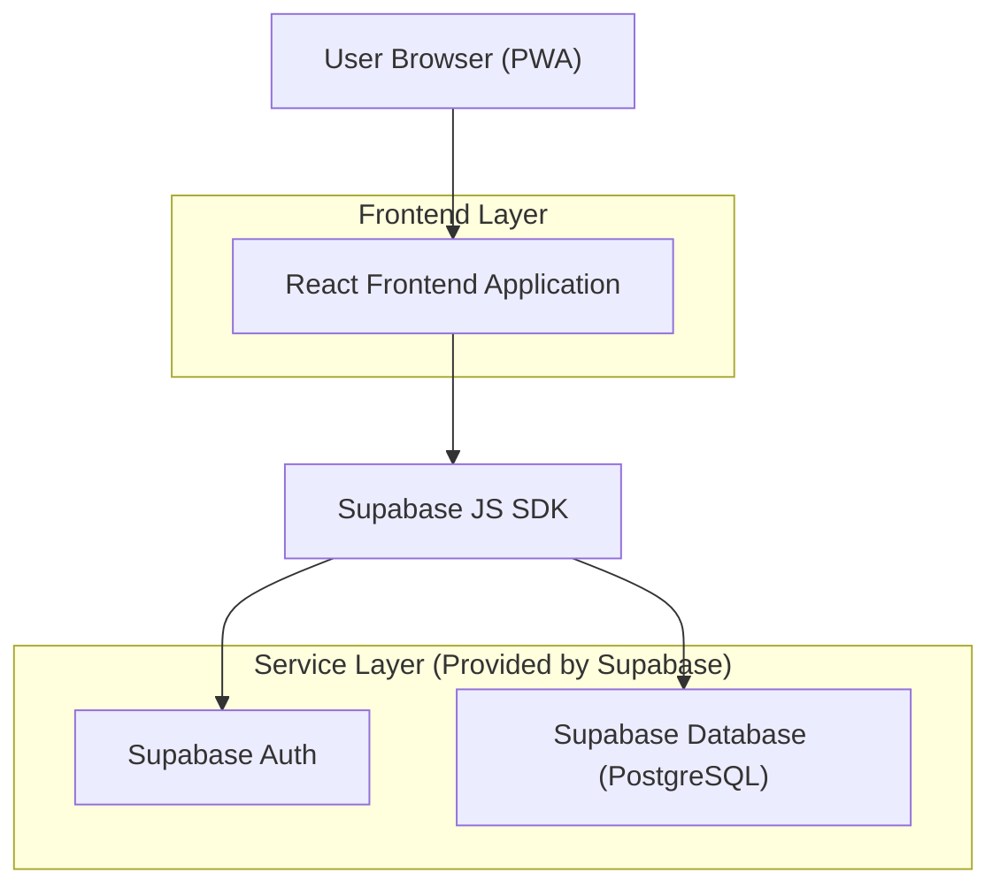
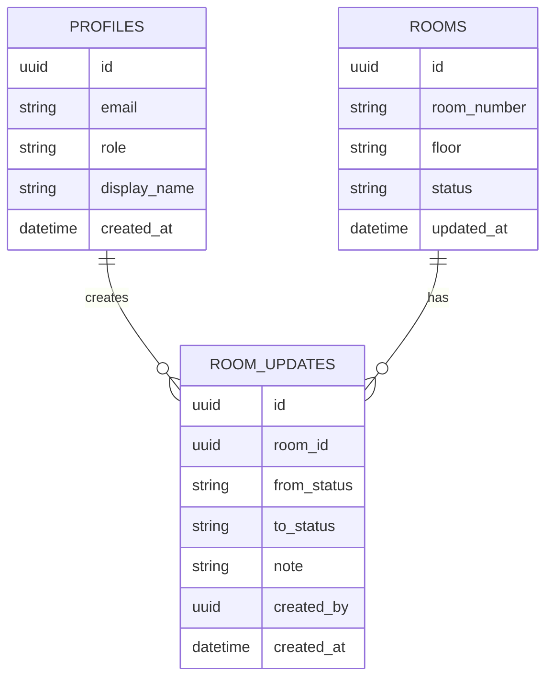

## 1.Architecture design


## 2.Technology Description
- Frontend: React@18 + TypeScript + vite + react-router + tailwindcss@3 + @supabase/supabase-js + Vite PWA plugin
- Backend: Supabase (Auth + Postgres + RLS)

## 3.Route definitions
| Route | Purpose |
|-------|---------|
| /login | Sign-in page (Supabase Auth) |
| /rooms | Rooms Board (cards, filters, quick actions) |
| /rooms/:roomId | Room Detail (status change, audit trail, notes) |

## 6.Data model(if applicable)

### 6.1 Data model definition


### 6.2 Data Definition Language
Profiles (profiles)
```
CREATE TABLE profiles (
  id UUID PRIMARY KEY,
  email TEXT NOT NULL,
  role TEXT NOT NULL CHECK (role IN ('housekeeper','supervisor','frontdesk','admin')),
  display_name TEXT,
  created_at TIMESTAMPTZ DEFAULT NOW()
);

CREATE TABLE rooms (
  id UUID PRIMARY KEY DEFAULT gen_random_uuid(),
  room_number TEXT NOT NULL,
  floor TEXT,
  status TEXT NOT NULL CHECK (status IN ('dirty','in_progress','cleaned','inspected','released')),
  updated_at TIMESTAMPTZ DEFAULT NOW()
);

CREATE TABLE room_updates (
  id UUID PRIMARY KEY DEFAULT gen_random_uuid(),
  room_id UUID NOT NULL,
  from_status TEXT NOT NULL,
  to_status TEXT NOT NULL,
  note TEXT,
  created_by UUID NOT NULL,
  created_at TIMESTAMPTZ DEFAULT NOW()
);

CREATE INDEX idx_rooms_status ON rooms(status);
CREATE INDEX idx_room_updates_room_id_created_at ON room_updates(room_id, created_at DESC);
```

RLS + access (overview)
```
-- Grants (typical Supabase baseline)
GRANT SELECT ON rooms TO anon;
GRANT SELECT ON room_updates TO anon;
GRANT ALL PRIVILEGES ON rooms TO authenticated;
GRANT ALL PRIVILEGES ON room_updates TO authenticated;
GRANT ALL PRIVILEGES ON profiles TO authenticated;

-- Enable RLS
ALTER TABLE profiles ENABLE ROW LEVEL SECURITY;
ALTER TABLE rooms ENABLE ROW LEVEL SECURITY;
ALTER TABLE room_updates ENABLE ROW LEVEL SECURITY;

-- Policy sketches (implement with your preferred role-lookup approach)
-- 1) Authenticated users can read rooms and updates.
-- 2) Updates/inserts allowed only if:
--    - user role permits the transition AND
--    - from_status matches current rooms.status AND
--    - rooms.status is updated accordingly (via RPC or transaction pattern).
```

Notes on workflow enforcement
- Recommended: implement a single SQL RPC (Postgres function) like `transition_room_status(room_id, to_status, note)` to atomically validate role + transition + write `room_updates` + update `rooms.status`.
- Frontend reads role from `profiles` and only renders allowed actions; database remains the source of truth via RLS/RPC validation.
